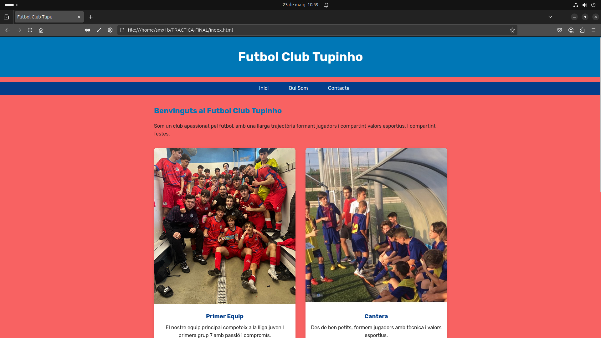
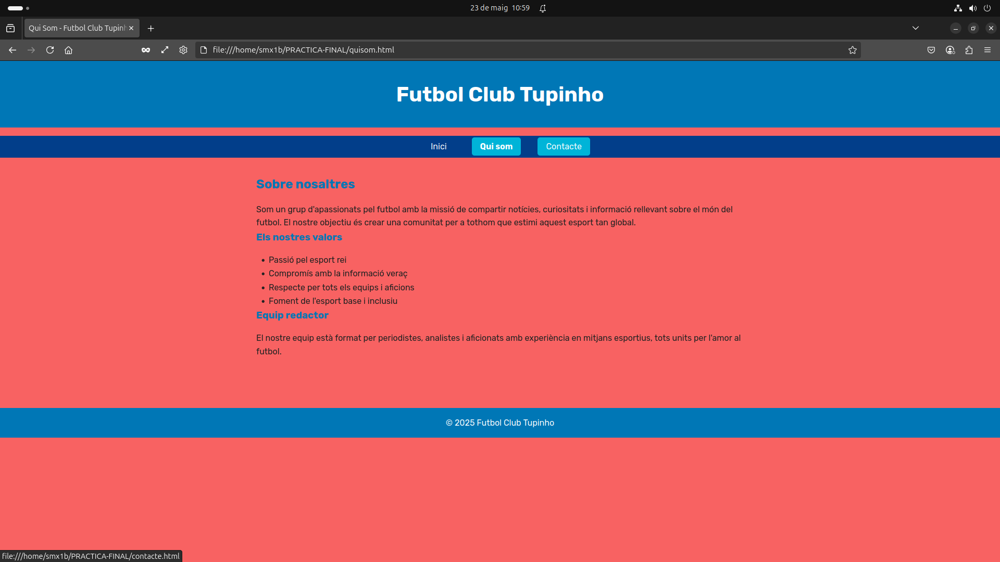
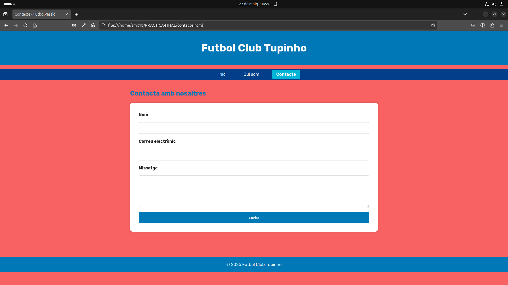
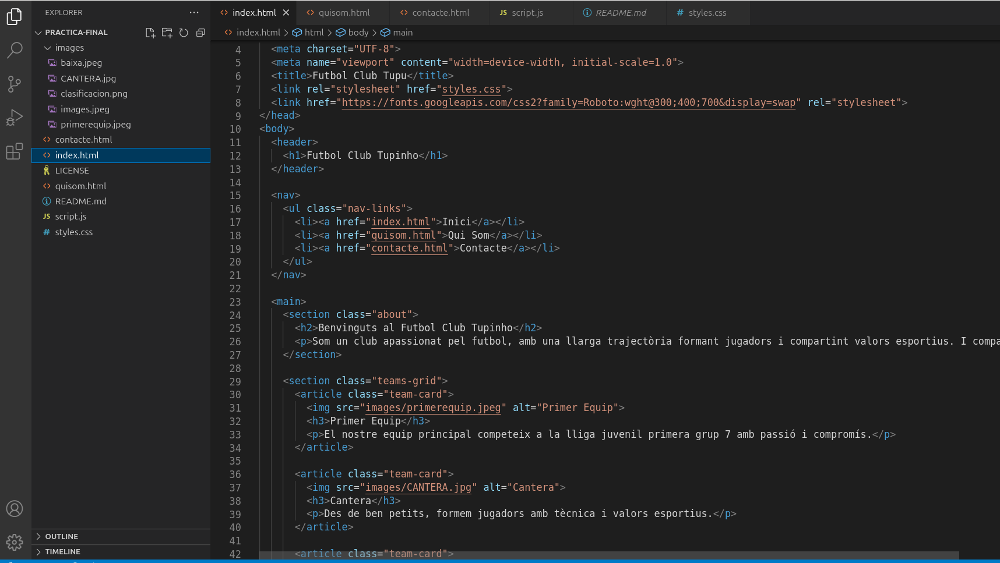
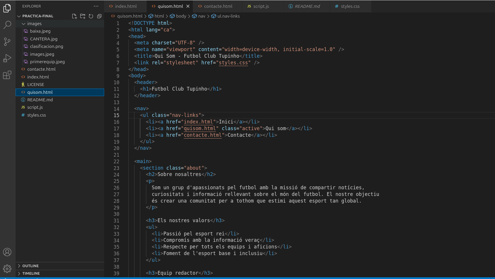
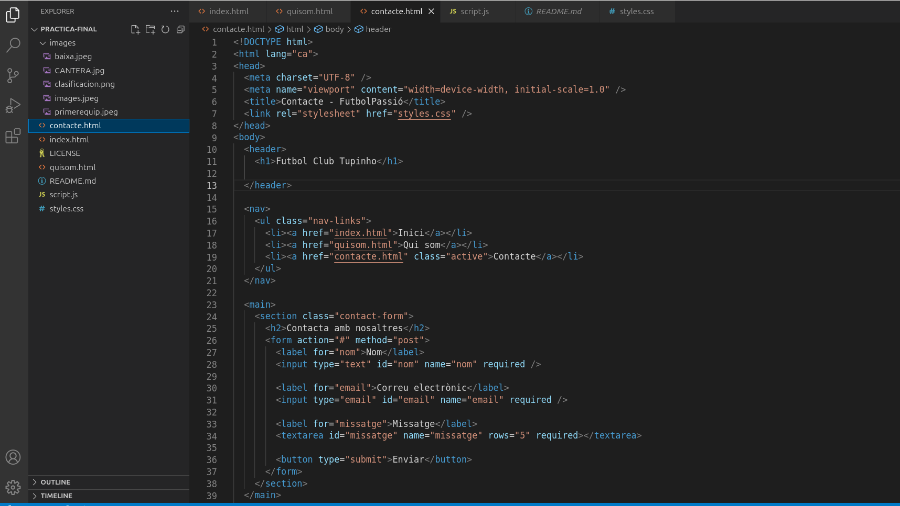
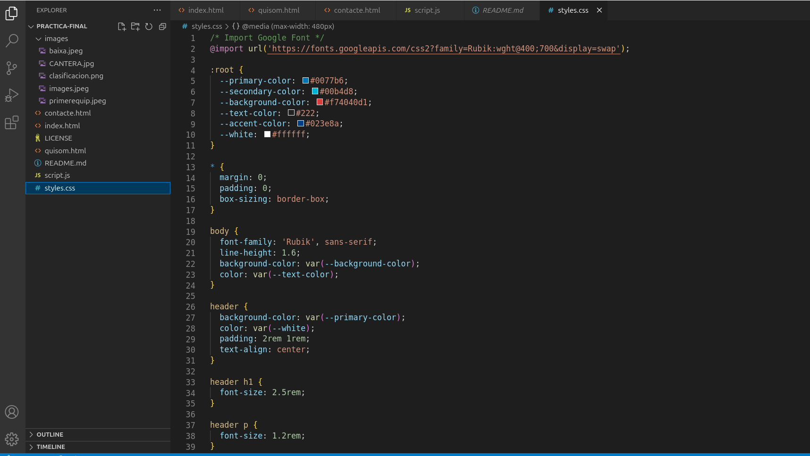
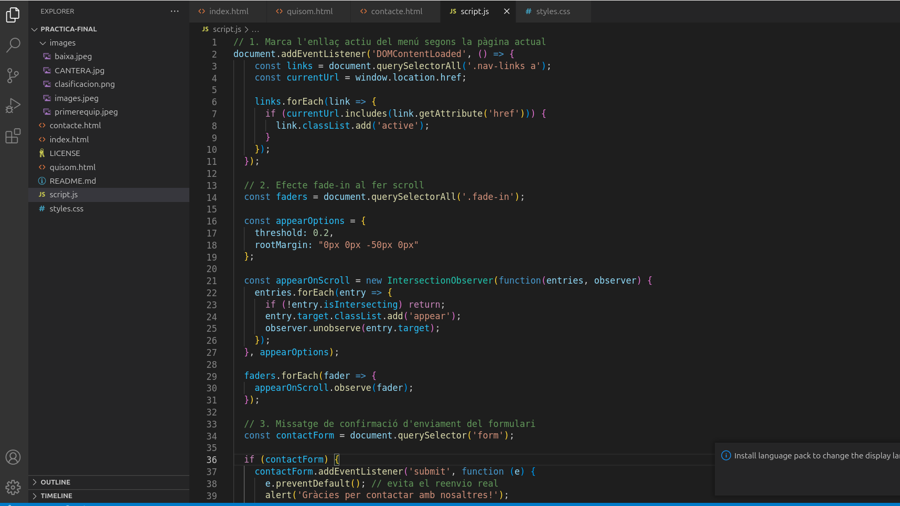

# PRACTICA-FINAL

# Futbol Club Tupinho

Benvingut al lloc web oficial del **Futbol Club Tupinho**, una pràctica web desenvolupada en HTML5, CSS3 i JavaScript per mostrar un club fictici amb disseny modern, navegació funcional i contingut atractiu.

## Descripció del projecte

Aquest projecte consisteix en una **pàgina web responsive** amb diverses seccions informatives:

- Pàgina d'inici (`index.html`)

.

- Qui som (`quisom.html`)

.

- Contacte (`contacte.html`)

.

Està dissenyada per complir amb els requisits d'una pràctica de disseny web i pensada per obtenir la màxima qualificació.

## Estructura de carpetes

├── index.html

├── quisom.html

├── contacte.html

├── styles.css

├── script.js

├── README.md

└── images/

---

## Tecnologies utilitzades

- HTML5
- CSS3 (amb disseny responsive i animacions)
- JavaScript bàsic (`script.js`)
- Google Fonts (Roboto)

---

##  Detall de cada fitxer

### `index.html`
- Presentació del club.
- Grid amb targetes per al primer equip, cantera, estadi i classificació.
- Navegació principal comuna.

.

### `quisom.html`
- Secció informativa sobre la missió i valors del club.
- Ús de llistes i seccions per facilitar la lectura.

.

### `contacte.html`
- Formulari de contacte amb camps obligatoris.
- Layout net i accessible.

.

### `styles.css`
- Colors personalitzats i tipografia coherent.
- Efectes `hover`, `transition` i animacions suaus.
- Layouts amb `flexbox` i `grid`.
- Responsive a través de `media queries`.
- Classe `.active` per destacar la pàgina actual.

.

### `script.js`
- Marca automàticament l'enllaç actiu a la navbar segons la pàgina visitada.

.

---

## Requisits completats

Layout estructurat i semàntic   
Navegació funcional entre pàgines  
Estils coherents i visuals  
Animacions i efectes  
Disseny responsive per mòbil  
Formulari funcional (HTML)
Codi net i organitzat
Publicació a GitHub Pages  

